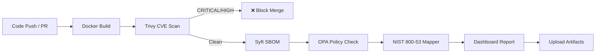

# Vuln-Scanner


A CI/CD pipeline that automatically scans Docker container images for known vulnerabilities (CVEs) on every code push, blocks deployments when critical issues are found, and generates federal compliance artifacts including NIST 800-53 control mappings and Software Bills of Materials (SBOMs). Built with open-source tooling to demonstrate how DevSecOps automation can satisfy federal security requirements without expensive commercial tools.

## Architecture



## Tech Stack

| Component | Tool | Purpose |
|-----------|------|---------|
| Web Application | Python FastAPI | Lightweight API with auto-docs at `/docs` |
| Containerization | Docker | Multi-stage build, non-root user, minimal image |
| CI/CD | GitHub Actions | Orchestrate build, scan, and report on every push |
| Vulnerability Scanner | Trivy (Aqua Security) | Scan images for CVEs; JSON output for processing |
| SBOM Generator | Syft (Anchore) | Produce CycloneDX SBOM from the built image |
| Policy Engine | Open Policy Agent (OPA) | Evaluate scan results against Rego policies |
| Compliance Mapper | Python (custom) | Map findings to NIST 800-53 controls |
| Dashboard | Python (custom) | Aggregate all results into a readable report |

## Run Locally

**Prerequisites:** Docker installed on your machine.

```bash
# 1. Clone the repository
git clone https://github.com/lavindeep/Vuln-scanner.git
cd Vuln-scanner

# 2. Build the Docker image
docker build -t vuln-scanner:local .

# 3. Run the container
docker run -p 8000:8000 vuln-scanner:local

# 4. Test the endpoints
curl http://localhost:8000        # Project metadata
curl http://localhost:8000/health # Health check
# Visit http://localhost:8000/docs for interactive Swagger UI
```

## Pipeline Stages

### 1. Docker Build
The Dockerfile uses a **multi-stage build** — dependencies are installed in a temporary builder stage, then only the runtime files are copied to the final image. The app runs as a non-root user (`appuser`) for security compliance.

### 2. Trivy Vulnerability Scan
[Trivy](https://github.com/aquasecurity/trivy) scans the built image for known CVEs. The pipeline runs two passes: a human-readable table printed to the Actions console, and a JSON export consumed by downstream scripts. The build **fails** if any CRITICAL or HIGH severity CVEs with available fixes are detected.

### 3. SBOM Generation
[Syft](https://github.com/anchore/syft) produces a CycloneDX-format Software Bill of Materials listing every package in the image. This satisfies Executive Order 14028 Section 4(e) requirements for SBOM delivery.

### 4. OPA Policy Evaluation
[Open Policy Agent](https://www.openpolicyagent.org/) evaluates the scan results against custom Rego policies:
- **No CRITICAL CVEs** — any critical finding is an automatic violation
- **90-day patch window** — CVEs older than 90 days with available fixes must be remediated
- **Required labels** — the Docker image must have `maintainer`, `version`, and `description` labels

### 5. NIST 800-53 Compliance Mapping
A custom Python script maps each vulnerability to relevant NIST 800-53 Rev5 controls, producing a structured compliance report.

### 6. Dashboard Report
A final script aggregates all outputs into a single markdown dashboard with pass/fail status, severity counts, policy violations, and top findings — designed for non-technical reviewers like program managers or ATO reviewers.

## NIST 800-53 Controls

| Control | Name | How Satisfied |
|---------|------|---------------|
| SI-2 | Flaw Remediation | Every CVE triggers this control; report notes fix availability |
| RA-5 | Vulnerability Monitoring | Automated scanning on every push satisfies continuous monitoring |
| CM-6 | Configuration Settings | Dockerfile best practices (non-root, pinned versions, labels) |
| CM-7 | Least Functionality | Scans flag unnecessary packages that increase attack surface |
| SA-11 | Developer Testing | The automated CI/CD pipeline itself demonstrates this control |
| SC-28 | Protection of Information at Rest | Flags credentials or secrets found in image layers |

## Executive Order 14028 Compliance

EO 14028 (May 2021) requires federal agencies and their software suppliers to:

1. **Produce SBOMs** (Section 4e) — Syft generates a CycloneDX SBOM on every build
2. **Automate security testing** (Section 4r) — Trivy scans run in CI/CD on every push
3. **Maintain vulnerability disclosure** (Section 4n) — The compliance report maps all findings to federal controls

## Customize Policies

Edit `policies/image_policy.rego` to adjust:

```rego
# Add or remove allowed base images
allowed_bases := {"python:3.12-slim", "python:3.11-slim"}

# Change the max CVE age (days)
age_days > 90   # ← change this number

# Add required labels
required_labels := {"maintainer", "version", "description"}
```

The base image is also verified in the workflow via a `grep` check on the Dockerfile's `FROM` statement for reliability.

## Artifacts

After each pipeline run, download these from the GitHub Actions summary page:

| Artifact | Description |
|----------|-------------|
| `trivy-results.json` | Raw Trivy scan output |
| `sbom.cyclonedx.json` | CycloneDX Software Bill of Materials |
| `compliance-report.md` | NIST 800-53 control mapping report |
| `opa-output.json` | OPA policy evaluation results |
| `dashboard.md` | Aggregated summary dashboard |
